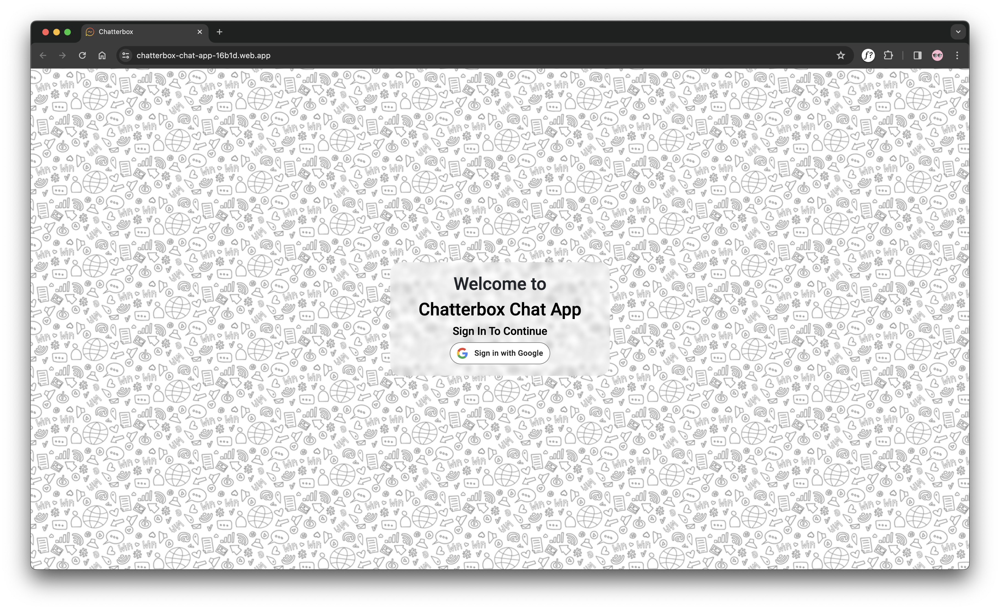
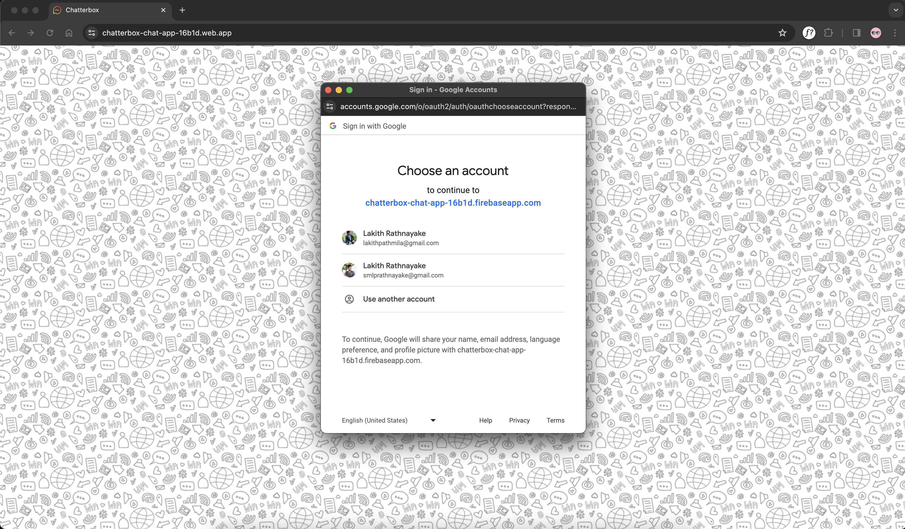
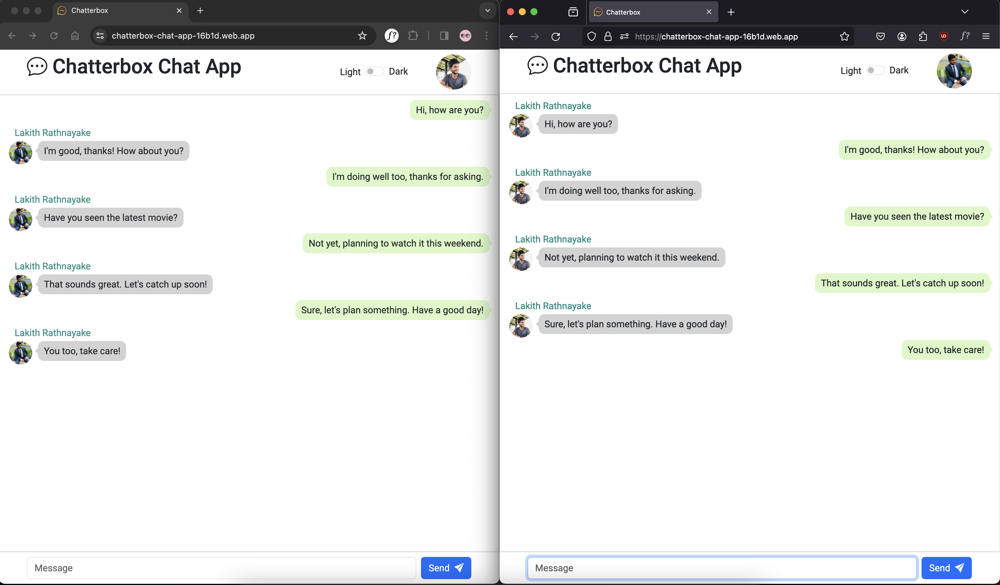
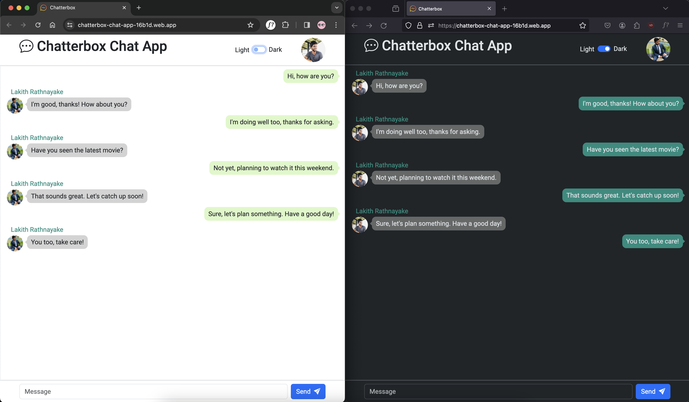
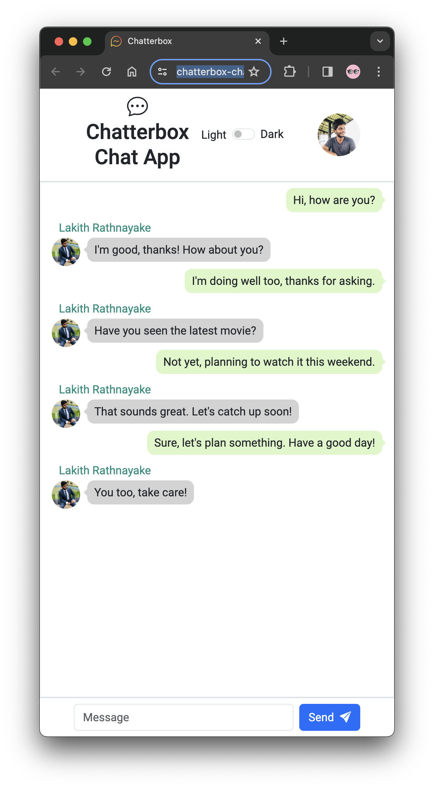
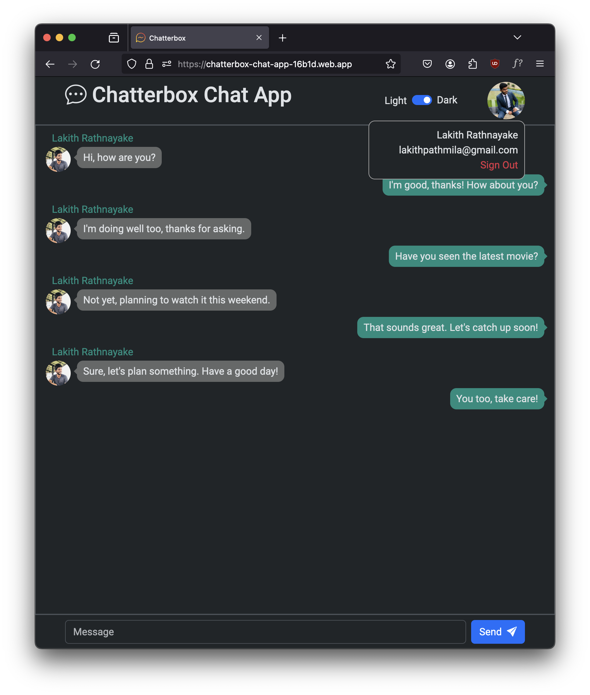

# Chatterbox Chat App

Frontend Deployed Link: https://chatterbox-chat-app-16b1d.web.app

## Table of Contents

- [Description](#description)
- [Features](#features)
- [Screenshots](#screenshots)
- [Technologies Used](#technologies-used)
- [Usage](#usage)
- [Contributing](#contributing)
- [Contact](#contact)
- [Version](#version)
- [License](#license)

## Description

Chatterbox is a cutting-edge chat application designed to facilitate seamless communication between users. This interactive chat platform harnesses the power of **WebSockets** and the **Spring Framework**, enabling real-time messaging capabilities. The backend of Chatterbox is powered by the robust **Spring Framework**, providing a reliable and scalable architecture.

Furthermore, Chatterbox incorporates **Firebase** for essential functionalities such as user authentication and deployment. Firebase Authentication ensures secure login and logout mechanisms, safeguarding user privacy and access control. Additionally, the deployment of the application is seamlessly managed using Firebase hosting.

## Features

- **Real-time Communication**: Utilizing WebSockets for instant messaging.
- **User Authentication**: Secure authentication provided by Firebase.
- **Sleek User Interface**: Intuitive interface using HTML, CSS, and JavaScript.
- **Dark Mode/Light Mode Switch**: Toggle between dark and light modes for personalized visual preferences.

## Screenshots

### Google Sign In

### General Usage

### Dark Mode

### Mobile Responsive

### User Details and Sign Out

## Technologies Used

- **Frontend Development**:
  - HTML, CSS, JavaScript
  - Firebase Authentication: Securely handles user authentication, ensuring only        authorized individuals can access the app.
  - Firebase Deployment: Hosts the frontend code, ensuring global accessibility and scalability.

- **Backend Development**:
  - Spring Framework: Powers the backend logic, managing user data, message storage, and communication with the frontend.
  - WebSockets: Facilitates real-time, bidirectional communication between the frontend and backend, enabling instant message delivery and updates.

## Usage
To use the Chatterbox Chat App, follow these steps:

1. **Download the Project**:
   - Download the Chatterbox project from the [repository](https://github.com/Lakith-Rathnayake/chatterbox-chat-app).

2. **Backend Setup**:
   - Open the backend folder in an IDE like IntelliJ IDEA.
   - Run `mvn clean package` to install project dependencies specified in the backend's `pom.xml`.
   - Deploy the backend on a Tomcat server within your IDE.

3. **Frontend Deployment**:
   - Access the deployed frontend using Firebase hosting at [Firebase Frontend Link](https://chatterbox-chat-app-16b1d.web.app).
   - Use this link to access the frontend part of the application.

4. **Using the App**:
   - Access the deployed frontend application link provided above to start using Chatterbox for seamless communication.

## Contributing

If you'd like to contribute to this project, please follow these steps:

1. Fork the repository
2. Create a new branch (`git checkout -b feature/your-feature`)
3. Make your changes
4. Commit your changes (`git commit -m 'Add some feature'`)
5. Push to the branch (`git push origin feature/your-feature`)
6. Create a new pull request

## Contact

For any inquiries or support, feel free to contact the project maintainer:

- Name: [Lakith Rathnayake](https://github.com/Lakith-Rathnayake)
- Email: lakithpathmila@gmail.com
- LinkedIn: [Lakith Rathnayake](https://www.linkedin.com/in/lakith-rathnayake/)

## Version

1.0.0

## License

Copyright &copy; 2023 Lakith Rathnayake. All Rights Reserved. 
This project is licensed under the [MIT License](LICENSE.txt)
